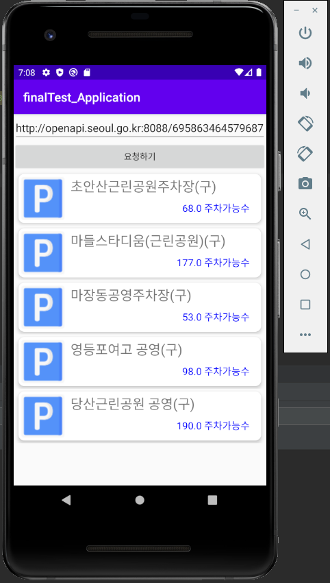

 # 모든 파일 업로드
 
 ## 기말고사 및 졸업작품
  
 app/src/ main/java/com/example/parking 에 있음
 
 어플리케이션 구상 
 주제 : 서울시 공영주차장 안내 정보
 
 데이터 출처: 서울 열린 데이터 광장에서 받아옴 (로그인 후 인증키를 받음)
 
 구상 목적 : 공영주차장 안내 정보 데이터 만들기
 
 어플리케이션 응용: 13 ~ 14주차 json을 이용한 데이터 시각화 응용
 
 실행화면
 
